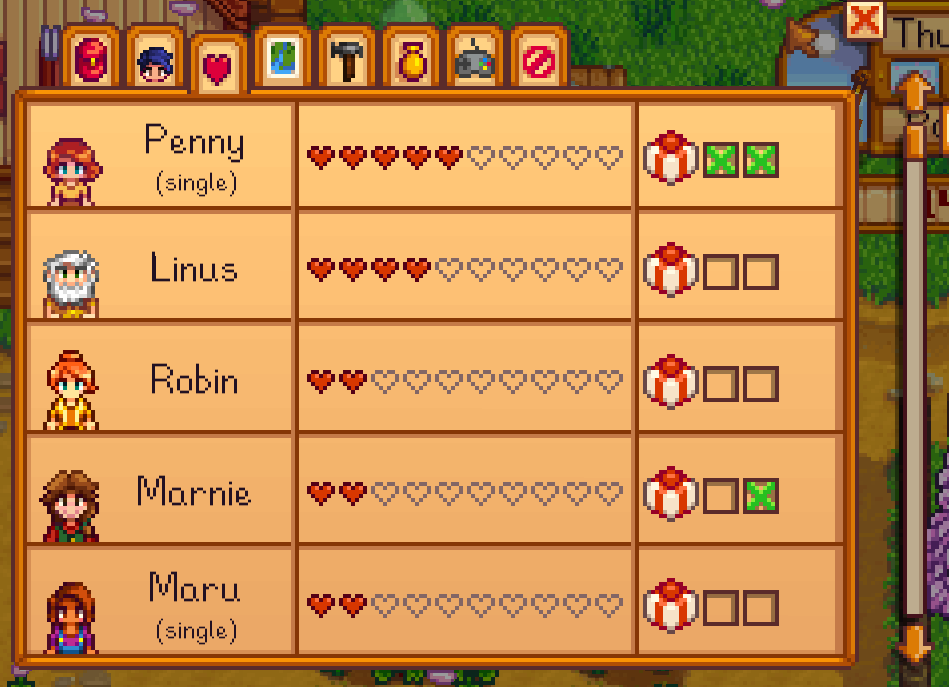
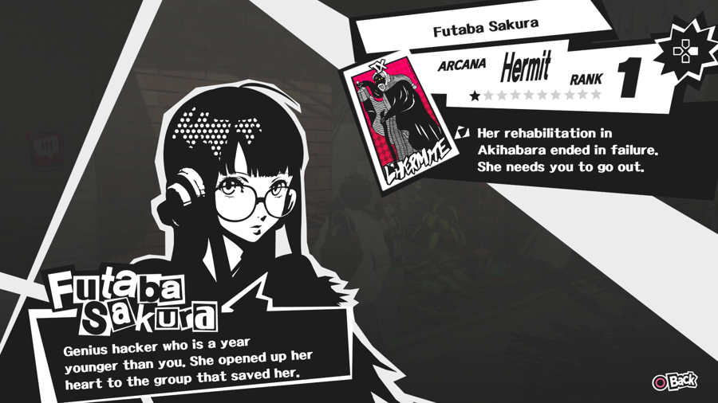

##

https://i0.wp.com/switchaboo.com/wp-content/uploads/2018/02/Relationships.png

##

http://www.gamersheroes.com/wp-content/uploads/2017/04/Persona-5-Confidant-Guide-Futaba.jpg

##

- Unidirectional agency in relationships
	- Player can initiate, mediate, advance, &.c
	- NPCs can "afford" interaction through authored content or systematic features
- NPCs are typically unable to make decisions vis-a-vis the relationship itself
- Technical issues notwithstanding, this is still kind of dicey???
- Shift from platonic relationships to immediately romantic ones?
- Lack of awareness of player relationships with other community members??

##

- "Bisexual wonderland" and "universal bisexuality" [see here](http://www.firstpersonscholar.com/planting-the-seeds-for-positive-queer-representation/)
- Weird representation of ostensibly queer characters who embody willingness to have same-sex partners strictly as a means to increase player choice
- But not as, you know, _identity_

<blockquote class="fragment">Though it may not have been the producers’ intentions, Harold’s flamboyant actions do not seem authentic and, in fact, seem deliberately exaggerated for comedic effect rather than authentic representation. (ibid.)</blockquote>

<!-- http://www.firstpersonscholar.com/va-11-hall-a/ (start of work on cooking, cleaning, making "foods", &c.?) -->